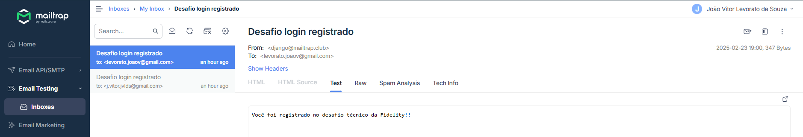

# Desafio Login

## Instalação

Intalar Django
```bash
pip install django
```
Rodar o servidor
```bash
python manage.py runserver
```
Criar um super usuário
```bash
python manage.py createsuperuser
```
Alterações no banco de dados
```bash
python manage.py makemigrations
python manage.py migrate
```

## URLS

- /desafio/login - Página de login do usuário
- /desafio/register - Página para registro de usuário
- /desafio - Página do menu
- /desafio/logout - Logout do usuário

## Login View

Na view de login primeiro é feito uma verificação se o e-mail realmente existe no banco de dados através de um filtro. Depois, o usuário e a senha são autenticados e redirecionados para a página do menu. Caso não seja possível autenticar o usuário a senha está inválida.

## Register View

Na view de registro é feito uma verificação se o nome do usuário segue os padrões desejados do sistema, logo em seguida o e-mail é verificado, checando se o mesmo já existe no banco de dados. Por fim, ultima verificação é feita para a senha, checando se a senha e a confirmação de senha são iguais e se a senha segue os padrões desejados do sistema.

Após todas as verificações o usuário é criado e redirecionado para a página de login.

O formulário de registro é feito através do `CreateUserForm`, onde é passado o modelo de usuário e os campos desejados.

## Envio de e-mail

O envio de e-mail é feito através do método send_mail do Django, onde é passado o assunto, a mensagem e o e-mail de destino. Como teste foi utilizado o site [Mailtrap](https://mailtrap.io/) para simular o envio de e-mail, as configurações de e-mail estão no arquivo `settings.py`.

